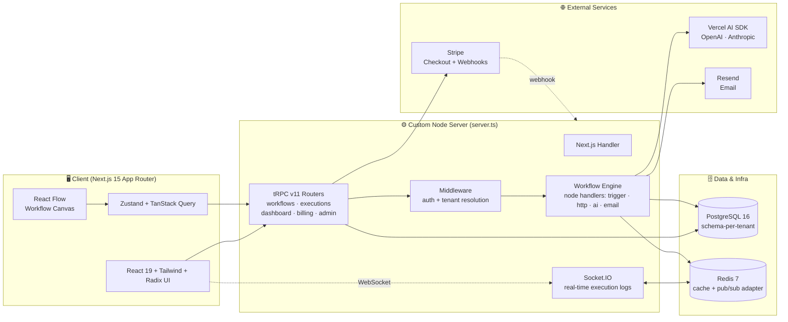
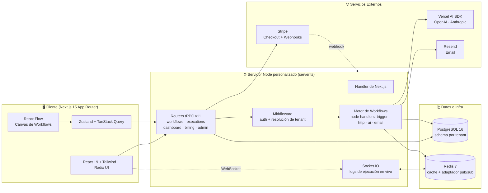

# AI Workflow Hub — Multi-tenant SaaS for AI Automation Workflows


> **Multi-tenant B2B SaaS** — a no-code platform where agencies and companies visually build, execute, and monetize AI-powered automation workflows, each tenant fully isolated in its own PostgreSQL schema.

---

<details open>
<summary><h2>🇺🇸 English</h2></summary>

### Architecture

Clean Architecture (domain → application → infrastructure) running on a **custom Node HTTP server** that hosts both Next.js and a Socket.IO real-time layer. Every tenant is isolated in its own PostgreSQL schema, resolved by middleware on each request.



---

### Features

- **Visual workflow editor** — drag-and-drop canvas built on React Flow to wire nodes into automation pipelines, with editor state managed in Zustand.
- **Pluggable node engine** — an executor with a handler registry for `trigger` (manual / webhook / schedule), `http`, `ai`, and `email` node types.
- **AI nodes** — call OpenAI or Anthropic (Claude) models through the Vercel AI SDK as steps inside a workflow.
- **Schema-per-tenant multi-tenancy** — each organization gets an isolated PostgreSQL schema, resolved from the subdomain/slug by middleware before every request.
- **Real-time execution feed** — Socket.IO streams live execution logs to the browser, scaled across instances via the Redis adapter.
- **Type-safe API** — end-to-end typing with tRPC v11 (`workflows`, `executions`, `dashboard`, `billing`, `admin` routers) and Zod validation.
- **Stripe billing** — plan-based subscriptions with Checkout, tiered limits (executions / workflows / projects / members), and signature-verified webhooks.
- **Workflow marketplace** — tenants can list, moderate (draft → pending → approved), and sell workflow snapshots to other tenants.
- **Auth** — NextAuth v5 with credentials plus Google and GitHub OAuth, backed by the Prisma adapter.
- **Admin panel** — a super-admin surface for managing plans, tenants, and marketplace moderation.

---

### Quick Start

```bash
# 1. Clone and install
git clone https://github.com/cdgutierrez6/ai-workflow-hub.git
cd ai-workflow-hub
npm install

# 2. Configure environment
cp .env.example .env.local
# Edit .env.local — set NEXTAUTH_SECRET, OPENAI_API_KEY / ANTHROPIC_API_KEY,
# Stripe keys, and leave DATABASE_URL / REDIS_URL as-is for local Docker.

# 3. Start infrastructure (Postgres + Redis)
docker compose up postgres redis -d

# 4. Initialize the database
npm run db:push      # apply Prisma schema
npm run db:seed      # create FREE / STARTER / PRO / ENTERPRISE plans
npm run db:generate  # generate the Prisma client

# 5. Run the dev server (Next.js + Socket.IO)
npm run dev          # http://localhost:3000
```

Other useful scripts:

```bash
npm run build        # next build
npm run typecheck    # tsc --noEmit
npm run lint         # ESLint
npm test             # Vitest unit tests
npm run test:e2e     # Playwright E2E (needs a running dev server)
npm run db:studio    # Prisma Studio (visual DB editor)
```

---

### Project Structure

```
ai-workflow-hub/
├── server.ts                  # Custom HTTP server: Next.js + Socket.IO + graceful shutdown
├── prisma/
│   ├── schema.prisma          # Public schema: users, tenants, plans, marketplace
│   ├── seed.ts                # Seed plans / dev data
│   └── tenant-schema.sql      # Per-tenant tables (workflows, executions, …)
├── src/
│   ├── domain/                # Entities, value objects, events, interfaces (no framework deps)
│   ├── application/           # Use cases, DTOs, application services
│   ├── infrastructure/        # Prisma client, Redis cache, repositories, service adapters
│   ├── server/
│   │   ├── trpc/              # tRPC context + routers (workflows, executions, …)
│   │   ├── workflow-engine/   # Executor + node handlers (trigger, http, ai, email)
│   │   ├── realtime/          # Socket.IO server
│   │   ├── billing/           # Stripe integration
│   │   ├── ai/                # AI provider wiring
│   │   └── auth/              # NextAuth config
│   ├── app/                   # Next.js App Router: (admin) (app) (auth) (public) + api/
│   ├── components/            # ui, layout, workflow-editor, dashboard, billing, admin, landing
│   ├── hooks/                 # Zustand stores + Socket.IO hooks
│   ├── lib/                   # Utilities, validations
│   └── __tests__/             # Vitest suites (domain, executor, auth, middleware)
├── docker/                    # Dockerfile + infra
├── docker-compose.yml         # Postgres + Redis (+ admin UIs)
├── playwright.config.ts       # E2E config
└── vitest.config.ts           # Unit test config
```

---

### API Reference

**tRPC routers** (mounted at `/api/trpc`, consumed type-safely by the client):

| Router | Responsibility |
|---|---|
| `workflows` | CRUD and execution of workflows |
| `executions` | Execution history, status, and logs |
| `dashboard` | Aggregated metrics and charts |
| `billing` | Plans, Stripe Checkout, subscription state |
| `admin` | Super-admin management (plans, tenants, marketplace) |

**REST API routes** (`src/app/api`):

| Method | Route | Description |
|---|---|---|
| `*` | `/api/auth/[...nextauth]` | NextAuth handler (credentials + OAuth) |
| `POST` | `/api/auth/register` | Sign up a new user |
| `POST` | `/api/auth/forgot-password` | Password-reset request |
| `POST` | `/api/auth/logout` | Sign out |
| `GET` | `/api/auth/sso` · `/api/auth/redirect` | SSO / OAuth redirect flow |
| `POST` | `/api/webhooks/stripe` | Stripe webhook (signature-verified) |
| `*` | `/api/trpc/[trpc]` | tRPC endpoint |

---

### Environment Variables

| Variable | Description | Required |
|---|---|:---:|
| `DATABASE_URL` | PostgreSQL connection string | ✅ |
| `REDIS_URL` | Redis connection string | ✅ |
| `NEXTAUTH_SECRET` | Auth signing secret (≥ 32 chars) | ✅ |
| `NEXTAUTH_URL` | Full app URL, no trailing slash | ✅ |
| `GOOGLE_CLIENT_ID` / `GOOGLE_CLIENT_SECRET` | Google OAuth | ➖ |
| `GITHUB_CLIENT_ID` / `GITHUB_CLIENT_SECRET` | GitHub OAuth | ➖ |
| `OPENAI_API_KEY` | OpenAI — powers AI nodes | ➖ |
| `ANTHROPIC_API_KEY` | Anthropic (Claude) — powers AI nodes | ➖ |
| `STRIPE_SECRET_KEY` / `STRIPE_PUBLISHABLE_KEY` | Stripe API keys | ✅ |
| `STRIPE_WEBHOOK_SECRET` | Stripe webhook signature secret | ✅ |
| `RESEND_API_KEY` / `EMAIL_FROM` | Transactional email via Resend | ➖ |
| `AWS_ACCESS_KEY_ID` / `AWS_SECRET_ACCESS_KEY` / `AWS_BUCKET_NAME` / `AWS_REGION` | S3 / R2 document storage | ➖ |
| `PINECONE_API_KEY` / `PINECONE_INDEX` | Vector DB for RAG | ➖ |
| `NEXT_PUBLIC_APP_URL` | Public app URL (browser) | ✅ |
| `NEXT_PUBLIC_ROOT_DOMAIN` | Root domain for subdomain multi-tenancy | ✅ |
| `ADMIN_INITIAL_EMAIL` / `ADMIN_INITIAL_PASSWORD` | Bootstrap super-admin | ➖ |
| `ENCRYPTION_KEY` | AES-256-GCM key for integration credentials at rest | ✅ |

---

### Database

The **public schema** (`prisma/schema.prisma`) holds the control-plane tables; each tenant's workflows and executions live in an isolated per-tenant schema (`prisma/tenant-schema.sql`).

| Table | Purpose |
|---|---|
| `users` | Accounts, credentials, roles (`USER` / `SUPER_ADMIN`) |
| `accounts` · `sessions` · `verification_tokens` | NextAuth / OAuth persistence |
| `tenants` | Organizations — slug, `dbSchema`, owner, plan, Stripe IDs, subscription status |
| `plans` | Pricing tiers with limits (executions, workflows, projects, members) and feature flags (AI, API, RAG, SSO) |
| `marketplace_listings` | Sellable workflow snapshots with moderation status |
| `stripe_events` | Processed webhook events (idempotency) |

**Enums:** `UserRole`, `SubscriptionStatus` (`ACTIVE`/`TRIALING`/`PAST_DUE`/`CANCELED`/`UNPAID`), `MarketplaceStatus` (`DRAFT`/`PENDING`/`APPROVED`/`REJECTED`).

---

### Tech Stack

- **Next.js 15** (App Router) + **React 19** + **TypeScript** — application framework.
- **Custom Node server** (`server.ts`) — hosts Next.js and Socket.IO in one process with graceful shutdown.
- **tRPC v11** — end-to-end type-safe API, `superjson` transformer.
- **Prisma 5** + **PostgreSQL** — ORM and schema-per-tenant database.
- **Redis** (`ioredis`) + **Socket.IO Redis adapter** — cache and cross-instance pub/sub.
- **Socket.IO** — real-time execution logs to the browser.
- **NextAuth v5** + `@auth/prisma-adapter` — auth with credentials, Google, GitHub.
- **Vercel AI SDK** (`ai`, `@ai-sdk/openai`, `@ai-sdk/anthropic`) — AI node execution.
- **Stripe** — subscription billing and webhooks.
- **React Flow** — the visual workflow canvas.
- **Zustand** + **TanStack Query** + **Immer** — client and server state.
- **Radix UI** + **Tailwind CSS 3** + **CVA** + **lucide-react** — UI layer.
- **React Hook Form** + **Zod** — forms and validation.
- **Recharts** — dashboard visualizations.
- **Resend** — transactional email · **Winston** — logging.
- **Vitest** + **Playwright** — unit and E2E testing · **GitLab CI** — pipeline.

---

### Author

**Cristian Daniel Gutiérrez S.** — Solutions Architect | Full-Stack Engineer

[LinkedIn](https://www.linkedin.com/in/cristian-daniel-guti%C3%A9rrez-segura) · [Portfolio](https://portafolio-frontend-wheat.vercel.app) · [cdgutierrez6@gmail.com](mailto:cdgutierrez6@gmail.com)

</details>

---

<details>
<summary><h2>🇨🇴 Español</h2></summary>

### Arquitectura

Clean Architecture (dominio → aplicación → infraestructura) sobre un **servidor HTTP de Node personalizado** que aloja tanto Next.js como una capa de tiempo real con Socket.IO. Cada tenant queda aislado en su propio schema de PostgreSQL, resuelto por el middleware en cada request.



---

### Características

- **Editor visual de workflows** — canvas drag-and-drop construido sobre React Flow para conectar nodos en pipelines de automatización, con el estado del editor gestionado en Zustand.
- **Motor de nodos extensible** — un executor con un registro de handlers para nodos `trigger` (manual / webhook / schedule), `http`, `ai` y `email`.
- **Nodos de IA** — invocan modelos de OpenAI o Anthropic (Claude) a través del Vercel AI SDK como pasos dentro de un workflow.
- **Multi-tenancy con schema por tenant** — cada organización recibe un schema de PostgreSQL aislado, resuelto desde el subdominio/slug por el middleware antes de cada request.
- **Feed de ejecución en tiempo real** — Socket.IO transmite los logs de ejecución en vivo al navegador, escalado entre instancias vía el adaptador de Redis.
- **API type-safe** — tipado de extremo a extremo con tRPC v11 (routers `workflows`, `executions`, `dashboard`, `billing`, `admin`) y validación con Zod.
- **Billing con Stripe** — suscripciones por plan con Checkout, límites por tier (ejecuciones / workflows / proyectos / miembros) y webhooks con firma verificada.
- **Marketplace de workflows** — los tenants pueden publicar, moderar (draft → pending → approved) y vender snapshots de workflows a otros tenants.
- **Autenticación** — NextAuth v5 con credenciales más OAuth de Google y GitHub, respaldado por el adaptador de Prisma.
- **Panel de administración** — una superficie de super-admin para gestionar planes, tenants y moderación del marketplace.

---

### Inicio Rápido

```bash
# 1. Clonar e instalar
git clone https://github.com/cdgutierrez6/ai-workflow-hub.git
cd ai-workflow-hub
npm install

# 2. Configurar el entorno
cp .env.example .env.local
# Edita .env.local — define NEXTAUTH_SECRET, OPENAI_API_KEY / ANTHROPIC_API_KEY,
# las llaves de Stripe, y deja DATABASE_URL / REDIS_URL tal cual para el Docker local.

# 3. Levantar la infraestructura (Postgres + Redis)
docker compose up postgres redis -d

# 4. Inicializar la base de datos
npm run db:push      # aplica el schema de Prisma
npm run db:seed      # crea los planes FREE / STARTER / PRO / ENTERPRISE
npm run db:generate  # genera el cliente de Prisma

# 5. Ejecutar el servidor de desarrollo (Next.js + Socket.IO)
npm run dev          # http://localhost:3000
```

Otros scripts útiles:

```bash
npm run build        # next build
npm run typecheck    # tsc --noEmit
npm run lint         # ESLint
npm test             # tests unitarios con Vitest
npm run test:e2e     # E2E con Playwright (requiere el dev server corriendo)
npm run db:studio    # Prisma Studio (editor visual de la DB)
```

---

### Estructura del Proyecto

```
ai-workflow-hub/
├── server.ts                  # Servidor HTTP custom: Next.js + Socket.IO + apagado ordenado
├── prisma/
│   ├── schema.prisma          # Schema público: users, tenants, plans, marketplace
│   ├── seed.ts                # Seed de planes / datos de dev
│   └── tenant-schema.sql      # Tablas por tenant (workflows, executions, …)
├── src/
│   ├── domain/                # Entidades, value objects, eventos, interfaces (sin deps de framework)
│   ├── application/           # Casos de uso, DTOs, servicios de aplicación
│   ├── infrastructure/        # Cliente Prisma, caché Redis, repositorios, adaptadores de servicios
│   ├── server/
│   │   ├── trpc/              # Contexto + routers tRPC (workflows, executions, …)
│   │   ├── workflow-engine/   # Executor + node handlers (trigger, http, ai, email)
│   │   ├── realtime/          # Servidor Socket.IO
│   │   ├── billing/           # Integración con Stripe
│   │   ├── ai/                # Cableado de proveedores de IA
│   │   └── auth/              # Configuración de NextAuth
│   ├── app/                   # Next.js App Router: (admin) (app) (auth) (public) + api/
│   ├── components/            # ui, layout, workflow-editor, dashboard, billing, admin, landing
│   ├── hooks/                 # Stores de Zustand + hooks de Socket.IO
│   ├── lib/                   # Utilidades, validaciones
│   └── __tests__/             # Suites de Vitest (domain, executor, auth, middleware)
├── docker/                    # Dockerfile + infra
├── docker-compose.yml         # Postgres + Redis (+ UIs de admin)
├── playwright.config.ts       # Config de E2E
└── vitest.config.ts           # Config de tests unitarios
```

---

### Referencia de API

**Routers tRPC** (montados en `/api/trpc`, consumidos de forma type-safe por el cliente):

| Router | Responsabilidad |
|---|---|
| `workflows` | CRUD y ejecución de workflows |
| `executions` | Historial, estado y logs de ejecución |
| `dashboard` | Métricas agregadas y gráficos |
| `billing` | Planes, Stripe Checkout, estado de suscripción |
| `admin` | Gestión de super-admin (planes, tenants, marketplace) |

**Rutas REST** (`src/app/api`):

| Método | Ruta | Descripción |
|---|---|---|
| `*` | `/api/auth/[...nextauth]` | Handler de NextAuth (credenciales + OAuth) |
| `POST` | `/api/auth/register` | Registro de un nuevo usuario |
| `POST` | `/api/auth/forgot-password` | Solicitud de restablecimiento de contraseña |
| `POST` | `/api/auth/logout` | Cerrar sesión |
| `GET` | `/api/auth/sso` · `/api/auth/redirect` | Flujo de redirección SSO / OAuth |
| `POST` | `/api/webhooks/stripe` | Webhook de Stripe (firma verificada) |
| `*` | `/api/trpc/[trpc]` | Endpoint de tRPC |

---

### Variables de Entorno

| Variable | Descripción | Requerida |
|---|---|:---:|
| `DATABASE_URL` | Cadena de conexión de PostgreSQL | ✅ |
| `REDIS_URL` | Cadena de conexión de Redis | ✅ |
| `NEXTAUTH_SECRET` | Secreto de firma de auth (≥ 32 caracteres) | ✅ |
| `NEXTAUTH_URL` | URL completa de la app, sin slash final | ✅ |
| `GOOGLE_CLIENT_ID` / `GOOGLE_CLIENT_SECRET` | OAuth de Google | ➖ |
| `GITHUB_CLIENT_ID` / `GITHUB_CLIENT_SECRET` | OAuth de GitHub | ➖ |
| `OPENAI_API_KEY` | OpenAI — alimenta los nodos de IA | ➖ |
| `ANTHROPIC_API_KEY` | Anthropic (Claude) — alimenta los nodos de IA | ➖ |
| `STRIPE_SECRET_KEY` / `STRIPE_PUBLISHABLE_KEY` | Llaves de API de Stripe | ✅ |
| `STRIPE_WEBHOOK_SECRET` | Secreto de firma de webhooks de Stripe | ✅ |
| `RESEND_API_KEY` / `EMAIL_FROM` | Email transaccional vía Resend | ➖ |
| `AWS_ACCESS_KEY_ID` / `AWS_SECRET_ACCESS_KEY` / `AWS_BUCKET_NAME` / `AWS_REGION` | Almacenamiento de documentos S3 / R2 | ➖ |
| `PINECONE_API_KEY` / `PINECONE_INDEX` | Vector DB para RAG | ➖ |
| `NEXT_PUBLIC_APP_URL` | URL pública de la app (navegador) | ✅ |
| `NEXT_PUBLIC_ROOT_DOMAIN` | Dominio raíz para multi-tenancy por subdominio | ✅ |
| `ADMIN_INITIAL_EMAIL` / `ADMIN_INITIAL_PASSWORD` | Bootstrap del super-admin | ➖ |
| `ENCRYPTION_KEY` | Llave AES-256-GCM para credenciales de integración en reposo | ✅ |

---

### Base de Datos

El **schema público** (`prisma/schema.prisma`) contiene las tablas del plano de control; los workflows y ejecuciones de cada tenant viven en un schema por tenant aislado (`prisma/tenant-schema.sql`).

| Tabla | Propósito |
|---|---|
| `users` | Cuentas, credenciales, roles (`USER` / `SUPER_ADMIN`) |
| `accounts` · `sessions` · `verification_tokens` | Persistencia de NextAuth / OAuth |
| `tenants` | Organizaciones — slug, `dbSchema`, owner, plan, IDs de Stripe, estado de suscripción |
| `plans` | Tiers de precio con límites (ejecuciones, workflows, proyectos, miembros) y feature flags (AI, API, RAG, SSO) |
| `marketplace_listings` | Snapshots de workflows vendibles con estado de moderación |
| `stripe_events` | Eventos de webhook procesados (idempotencia) |

**Enums:** `UserRole`, `SubscriptionStatus` (`ACTIVE`/`TRIALING`/`PAST_DUE`/`CANCELED`/`UNPAID`), `MarketplaceStatus` (`DRAFT`/`PENDING`/`APPROVED`/`REJECTED`).

---

### Tecnologías

- **Next.js 15** (App Router) + **React 19** + **TypeScript** — framework de la aplicación.
- **Servidor Node personalizado** (`server.ts`) — aloja Next.js y Socket.IO en un solo proceso con apagado ordenado.
- **tRPC v11** — API type-safe de extremo a extremo, transformador `superjson`.
- **Prisma 5** + **PostgreSQL** — ORM y base de datos con schema por tenant.
- **Redis** (`ioredis`) + **adaptador de Redis para Socket.IO** — caché y pub/sub entre instancias.
- **Socket.IO** — logs de ejecución en tiempo real hacia el navegador.
- **NextAuth v5** + `@auth/prisma-adapter` — auth con credenciales, Google, GitHub.
- **Vercel AI SDK** (`ai`, `@ai-sdk/openai`, `@ai-sdk/anthropic`) — ejecución de nodos de IA.
- **Stripe** — billing de suscripciones y webhooks.
- **React Flow** — el canvas visual de workflows.
- **Zustand** + **TanStack Query** + **Immer** — estado de cliente y servidor.
- **Radix UI** + **Tailwind CSS 3** + **CVA** + **lucide-react** — capa de UI.
- **React Hook Form** + **Zod** — formularios y validación.
- **Recharts** — visualizaciones del dashboard.
- **Resend** — email transaccional · **Winston** — logging.
- **Vitest** + **Playwright** — testing unitario y E2E · **GitLab CI** — pipeline.

---

### Autor

**Cristian Daniel Gutiérrez S.** — Arquitecto de Soluciones | Ingeniero Full-Stack

[LinkedIn](https://www.linkedin.com/in/cristian-daniel-guti%C3%A9rrez-segura) · [Portafolio](https://portafolio-frontend-wheat.vercel.app) · [cdgutierrez6@gmail.com](mailto:cdgutierrez6@gmail.com)

</details>
